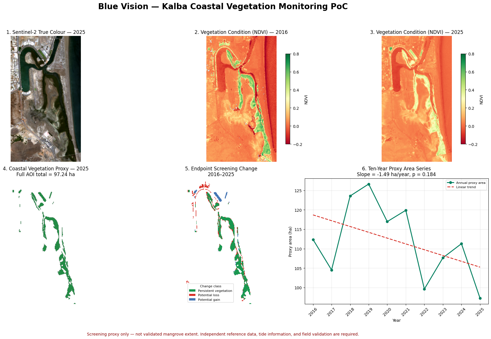

# Blue Vision — Kalba Mangrove Monitoring

**Team:** Blue Vision  
**Challenge:** Arab Youth Space Hackathon — Satellite 813 Challenge  
**Theme:** Ecosystem Health, Biodiversity & Blue Carbon  
**Country:** United Arab Emirates

Blue Vision is a reproducible satellite-based proof of concept that screens changes in coastal vegetation around Kalba, UAE, and prioritises locations for closer imagery review or field inspection.

[](https://colab.research.google.com/github/soghah/blue-vision-kalba-mangrove-poc/blob/main/Blue_Vision_Kalba_Mangrove_PoC.ipynb)

## 1. Business use case

The intended users are environmental authorities, protected-area managers, municipalities, and coastal planners. These users need to decide where limited field-inspection, conservation, and restoration resources should be directed. Existing monitoring can depend on time-consuming field surveys or manual comparison of individual images. Blue Vision provides a repeatable screening layer that helps users identify locations requiring further investigation; it does not replace ecological field assessment.

## 2. Problem

Kalba's coastal vegetation and mangrove environment is spatially narrow, tidally influenced, and exposed to changing coastal and urban conditions. Consistent long-term assessment is difficult when observations come from different dates, cloud conditions, and sensors. Earth-observation data are appropriate because they provide repeatable regional coverage, an historical archive, and spectral measurements related to vegetation and water.

## 3. Data used

| Dataset | Provider | Dates | Processing level | Use | Access and licence |
|---|---|---:|---|---|---|
| Sentinel-2 MSI | EU Copernicus Programme | Feb-Apr, 2016-2025 | Level-2A surface reflectance | Annual composites, NDVI, NDWI, change screening | Microsoft Planetary Computer STAC; modified Copernicus Sentinel data |
| ESA WorldCover | European Space Agency | 2021 | WorldCover 10 m product | Independent reference-map comparison | Microsoft Planetary Computer; ESA WorldCover product terms |
| EnMAP HSI | German Space Agency at DLR | 11 Sep 2025 | Level-2A | Hyperspectral demonstration and follow-up prioritisation | Official DLR EnMAP catalogue/portal; original licensed rasters are not redistributed |

**EnMAP scene ID:** `ENMAP01-____L2A-DT0000152124_20250911T072327Z_006_V010502_20250914T181224Z`

The open Sentinel-2 and WorldCover inputs are retrieved by the notebook using the documented Area of Interest and search parameters. The optional EnMAP rasters must be obtained separately under their applicable conditions.

## 4. Technical approach

1. Define the Kalba Area of Interest: `[56.32, 24.96, 56.40, 25.05]`.
2. Search Sentinel-2 Level-2A observations from February-April for 2016-2025.
3. Retain up to six of the lowest-cloud observations per year after applying a scene-level cloud threshold below 20%.
4. Use the Sentinel-2 Scene Classification Layer to exclude no-data, saturated, cloud-shadow, cloud, cirrus, and snow/ice pixels.
5. Build annual 20 m median composites and calculate NDVI and NDWI.
6. Create a coastal-vegetation screening proxy using NDVI > 0.25 and proximity to detected water, then remove isolated patches below 0.20 ha.
7. Compare 2016 and 2025 endpoints, calculate the 2016-2025 annual area series, fit a linear trend, and test NDVI-threshold sensitivity.
8. Compare the 2021 proxy with the ESA WorldCover 2021 mangrove class.
9. Demonstrate targeted EnMAP NDVI, NDRE, and vegetation water-content screening using one 2025 hyperspectral scene.

## 5. Installation

Python **3.11** is recommended.

```bash
git clone https://github.com/soghah/blue-vision-kalba-mangrove-poc.git
cd blue-vision-kalba-mangrove-poc
python -m venv .venv
```

Activate the environment:

```bash
# Linux or macOS
source .venv/bin/activate

# Windows PowerShell
.venv\Scripts\Activate.ps1
```

Install the pinned dependencies:

```bash
python -m pip install --upgrade pip
pip install -r requirements.txt
```

## 6. How to run

```bash
jupyter lab Blue_Vision_Kalba_Mangrove_PoC.ipynb
```

Restart the kernel and select **Run All**. No GPU is required. Runtime depends on network and STAC data access; allow approximately **15-30 minutes** in a standard hosted notebook environment. The Sentinel-2 and WorldCover workflow runs without private credentials or Google Drive. The EnMAP raster calculations are optional and are skipped safely when the licensed input files are absent.

The notebook writes or reproduces the main figures in the repository root.

## 7. Example input and output

The reproducible Sentinel-2 and WorldCover input parameters are listed in the Data used and Technical approach sections above. The notebook acts as the documented download script and retrieves the open inputs through STAC. Large satellite scenes and restricted imagery are not committed. To recompute the optional EnMAP section, create `data/enmap_optional/` locally and place the three licensed input files described in the notebook there.

Main decision dashboard:



Additional outputs:

- [Sentinel-2 endpoint composites](Blue_Vision_Endpoint_Composites.png)
- [ESA WorldCover reference comparison](Blue_Vision_WorldCover_Validation.png)
- [EnMAP hyperspectral diagnostics](Blue_Vision_EnMAP_Hyperspectral_Diagnostics.png)
- [EnMAP follow-up priority map](Blue_Vision_EnMAP_Follow_Up_Priority.png)

## 8. Results

- Coastal-vegetation proxy: **112.36 ha in 2016** and **97.24 ha in 2025**.
- Endpoint proxy difference: **-15.12 ha (-13.5%)**.
- Ten-year linear trend: **-1.49 ha/year**, with **R² = 0.209** and **p = 0.184**; the trend is not statistically significant at α = 0.05.
- ESA WorldCover 2021 reference agreement: **precision 0.720**, **recall 0.822**, **F1-score 0.768**, and **IoU 0.623**.
- EnMAP screening: **900 valid coastal-vegetation pixels**; **177** were in the lowest 10% of at least one hyperspectral indicator and **3 pixels (approximately 0.27 ha)** were in the lowest 10% of both.

## 9. Validation and limitations

- The mapped class is a **coastal-vegetation screening proxy**, not a validated mangrove boundary.
- Agreement with ESA WorldCover is not equivalent to field-validated classification accuracy.
- The ten-year linear trend is not statistically significant.
- Tide, mixed shoreline pixels, seasonal differences, acquisition geometry, thresholds, and residual atmospheric effects may influence the results.
- The 20 m working grid cannot resolve very narrow or fragmented vegetation precisely.
- The EnMAP assessment uses one acquisition date; its percentile thresholds are relative screening rules, not universal vegetation-stress thresholds.
- The September EnMAP scene is not seasonally identical to the February-April Sentinel-2 composites.
- Field observations, authoritative local boundaries, and tide information are required before ecological, carbon, restoration, or regulatory conclusions are made.
- Blue-carbon stock is not estimated because validated mangrove extent and an appropriate local carbon-density coefficient are not yet available.

## 10. Team, roles, licence, and attribution

### Team Blue Vision

- **Soghah Alsereidi — Project Lead and Geospatial Analysis Lead:** project coordination, study-area definition, Sentinel-2 workflow, change analysis, statistical interpretation, and scientific documentation.
- **Shouq Alzaabi — Engineering and Solution Design Lead:** workflow design, hyperspectral demonstration, quality review, decision-product design, impact model, and presentation development.

### Licence and attribution

Project code is released under the [MIT License](LICENSE). Dataset ownership and original product licences remain with their respective providers.

- Contains modified Copernicus Sentinel data (2016-2025), accessed through the Microsoft Planetary Computer.
- Contains modified ESA WorldCover 2021 data.
- Contains modified EnMAP data ©DLR 2025.

No credentials, private Drive links, full satellite scenes, or restricted original EnMAP rasters are included in this repository.
